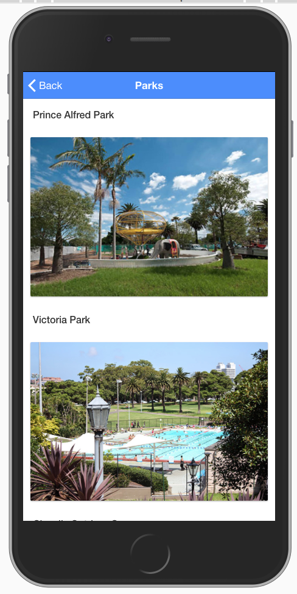

# Ionic MyPark Application

This is the official MyPark demo app, showcasing a variety of Ionic Framework components and native features.

## Table of Contents

* List Parks from json
* Detail Page
* Example List Parks
* Example Park Detail

## Screen shot

